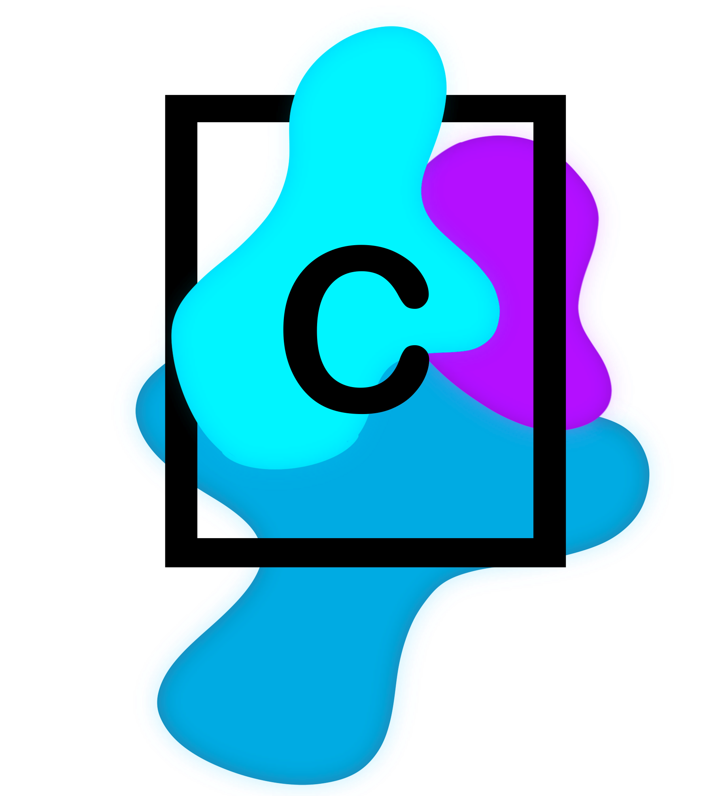

# Projektdokumentation codelineway
### By Delia Melanie Joel

| **Datum**  | **Version** | **Änderung** | **Autor** |
|------------|-------------|--------------|-----------|
| 11.08.2022 | 0.1         | Inital I P E | Joel      |
| 18.08.2022 | 0.2         |              |           |
| 25.08.2022 | 0.3         |              |           |
| 1.09.2022  | 0.4         |              |           |
| 8.09.2022  | 0.5         |              |           |
| 15.09.2022 | 0.6         |              |           |
| 22.09.2022 | 0.7         |              |           |
| 29.09.2022 | 1           |              |           |

# Informieren

## Projekt

Wir wollen einen Webshop realisieren. Man soll sich Registrieren und Anmelden können.   
Auch soll es möglich sein, etwas zu Bestellen. Im Shop soll man ganz verschiedene Dinge «kaufen» können.

## Quellen

## Anforderungen

| **Nummer** | **Muss / Kann?** | **Funktional? Qualität? Rand?** | **Beschreibung**                                                                               |
|------------|------------------|---------------------------------|------------------------------------------------------------------------------------------------|
| 1          | Muss             | Funktional                      | Ein Benutzer kann sich mit E-Mail und Passwort registrieren.                                   |
| 2          | Muss             | Funktional                      | Ein registrierter Benutzer kann sich mit E-Mail und Passwort anmelden.                         |
| 3          | Kann             | Qualität                        | Es gibt eine Password Policy.                                                                  |
| 4          | Muss             | Funktional                      | Es kann nach Produkten gesucht werden.                                                         |
| 5          | Muss             | Funktional                      | Alle Produkte, die der Suche entsprechen, werden angezeigt.                                    |
| 6          | Kann             | Qualität                        | Die Produkte werden in einer 4 Spaltigen Tabelle angezeigt, von links nach rechts aufgefüllt.  |
| 7          | Kann             | Qualität                        | Produkte haben einen Namen                                                                     |
| 8          | Kann             | Qualität                        | Produkte haben einen Preis                                                                     |
| 9          | Kann             | Qualität                        | Produkte haben eine Beschreibung                                                               |
| 10         | Kann             | Qualität                        | Produkte haben Spezifikationen                                                                 |
| 11         | Muss             | Funktional                      | Es gibt einen Warenkorb.                                                                       |
| 12         | Muss             | Funktional                      | Der Warenkorb kann gefüllt werden.                                                             |
| 13         | Kann             | Funktional                      | Produkte im Warenkorb können entfernt werden                                                   |
| 14         | Kann             | Funktional                      | Die Anzahl eines Produktes kann verändert werden                                               |
| 15         | Muss             | Funktional                      | Es gibt einen ausführlichen Bestellvorgang mit Formular für Name und Adresse.                  |
| 16         | Muss             | Qualität                        | Eine automatisch generierte Bestellbestätigung wird an den Kunden versendet.                   |
| 17         | Muss             | Qualität                        | Der Webshop hat eine Grundstruktur. Je nach Unterseite wird diese angepasst.                   |
| 18         | Muss             | Qualität                        | Das Design ist auf allen Sites gleich.                                                         |
| 19         | Muss             | Rand                            | Bootstrap wird nach Möglichkeit verwendet.                                                     |
| 20         | Muss             | Rand                            | CSS wird für Gestaltung, welche mit Bootstrap nicht möglich ist, verwendet.                    |
| 21         | Muss             | Rand                            | JavaScript wird für die Logik verwendet.                                                       |
| 22         | Muss             | Rand                            | Für die Datenbank wird … verwendet.                                                            |
| 23         | Muss             | Rand                            | GitHub Pages wird zum Hosten und Dokumentieren verwendet.                                      |
| 24         | Muss             | Rand                            | OneDrive wird als Speicherort verwendet.                                                       |
| 25         | Muss             | Rand                            | Das Projekt muss bis am 29.09.2022 fertig sein.                                                |

#  Planen

| **Nummer** | **Frist**  | **Beschreibung**                                                                       | **Zeit (geplant)** | **Zeit (effektiv)** |
|------------|------------|----------------------------------------------------------------------------------------|--------------------|---------------------|
| 1.1        | 11.08.2022 | Informieren über Datenbankanbindung und Suchsystem des Webshops.                       | 45                 |                     |
| 1.2        | 11.08.2022 | Planung fertig schreiben                                                               | 45                 | 60                  |
| 1.3        | 11.08.2022 | Dokumentation bis E beenden                                                            | 45                 | 30                  |
| 2.1        | 18.08.2022 | Mock Up erstellen: Main Page Joel Item Page Delia  Check-out / Anmelden Melanie        | 45                 |                     |
| 2.2        | 18.08.2022 | Coden des HTML Gerüstes:  Main Page Joel Item Page Delia Check-out / Anmelden Melanie  | 90                 |                     |
| 2.3        | 18.08.2022 | Coden des HTML Gerüstes für den Warenkorb (mit Hover auf Main Page)                    | 45                 |                     |
| 3.1        | 25.08.2022 | Logik (Datenbank) hinter Anmeldung und Registrierung implementieren                    | 90                 |                     |
| 3.2        | 25.08.2022 | Password Policy gestalten und Implementieren                                           | 90                 |                     |
| 4.1        | 1.09.2022  | Item Pages mit Main Page verknüpfen                                                    | 45                 |                     |
| 4.2        | 1.09.2022  | Item Page mit Informationen füllen                                                     | 90                 |                     |
| 4.3        | 1.09.2022  | Reserve                                                                                | 45                 |                     |
| 5.1        | 8.09.2022  | Implementation der Logik des Checks-outs                                               | 90                 |                     |
| 5.2        | 8.09.2022  | Automatisch generierte E-Mail implementieren                                           | 90                 |                     |
| 6.1        | 15.09.2022 | Warenkorb Logik                                                                        | 90                 |                     |
| 6.2        | 15.09.2022 | Warenkorb Bedienung                                                                    | 90                 |                     |
| 7.1        | 22.09.2022 | Reserve                                                                                | 225                |                     |
| 8          | 29.09.2022 | Portfolio Schreiben                                                                    | 90                 |                     |

#  Entscheiden

### Was für einen Namen nehmen wir für unseren Shop?   
Wir haben uns für codelineway entschieden. Über eine Namensgenerierung-Webpage haben wird diesen Namen gefunden.

### Wie wird die Password Policy gestaltet?   
Die Passwörter sollen mindestens 8 Zeichen beinhalten, darunter mindestens eine Zahl und mindestens einen Buchstaben.

### Was für einen Shop machen wir?  
Einen Code Shop. Man kann sich Code «kaufen», welcher man danach per E-Mail zugesendet bekommt.

#  Realisieren
#  Kontrollieren

## Testfälle

| **Nummer** | **Voraussetzung** | **Eingabe** | **Erwartete Ausgabe** |
|------------|-------------------|-------------|-----------------------|
| 1.1        |                   |             |                       |
| 2.1        |                   |             |                       |
| 3.1        |                   |             |                       |
| 4.1        |                   |             |                       |

## Testprotokoll

| **Nummer** | **Datum** | **Resultat** | **Durchgeführt** |
|------------|-----------|--------------|------------------|
| **1.1.1**  |           |              |                  |
| **2.1.1**  |           |              |                  |
| **3.1.1**  |           |              |                  |
| **4.1.1**  |           |              |                  |

#  Auswerten
